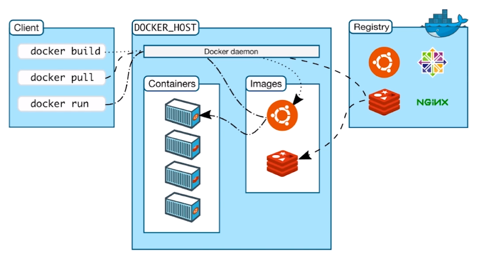
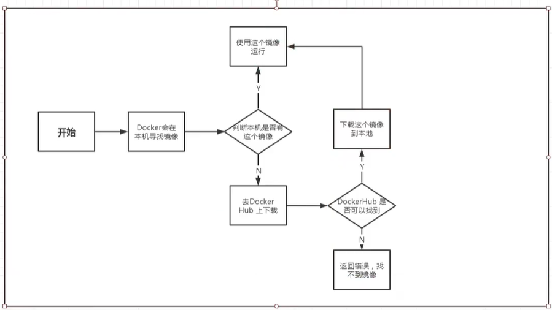
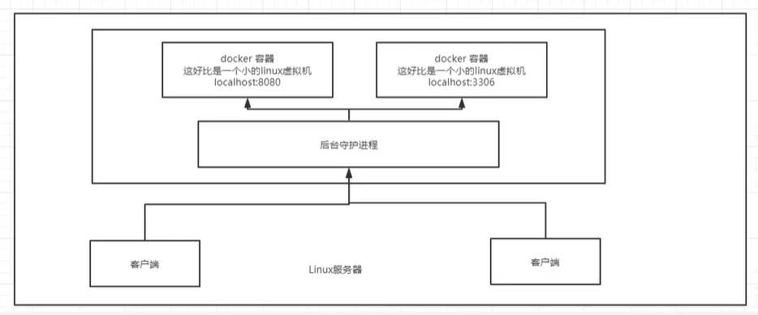
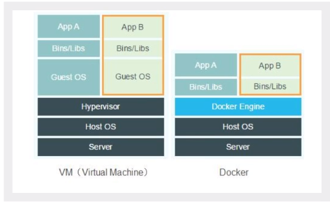

- Docker概述
- Docker安装
- Docker命令
    * 镜像命令
    * 容器命令
    * 操作命令
    * ...
- Docker镜像
- 容器数据卷
- DockerFile
- Docker网络原理
- IDEA整合Docker
- Docker Compose
- Docker Swarm
- CI\CD Jenkins


## Docker概述

Docker通过隔离机制，可以将服务器利用到极致

比较Docker和虚拟机技术的不同：

- 传统虚拟机，虚拟出一套硬件，运行一个完整的操作系统，然后再这个系统上安装的运行软件。
- 容器内的应用直接运行在宿主机内，容器没有自己的内核，也没有虚拟硬件。
- 每个容器时互相隔离的，每个容器内都有一个属于自己的文件系统，互不影响。
- Docker时内核级别的虚拟化，可以在一台物理机上运行很多的容器实例，服务器性能可以被压榨到极致。

## Docker安装



### 基本概念

#### 镜像（image）

docker镜像就好比一个模板，可以通过这个模板来创建容器服务
通过这个镜像可以创建多个容器，（最终服务运行或者项目运行就是在容器中）

#### 容器（container）

Docker利用容器技术，独立运行一个独立或者一组应用，通过镜像来创建
启动，停止，删除，基本命令
目前可以把这个容器理解为就是一个简易的linux系统

#### 仓库（repository）

仓库就是存放镜像的地方

### 安装

1. 卸载旧版本

```sh
yum remove docker \
           docker-client \
           docker-client-latest \
           docker-common \
           docker-latest \
           docker-latest-logrotate \
           docker-logrotate \
           docker-engine
```

2. 配置yum源

```sh
wget http://mirrors.aliyun.com/docker-ce/linux/centos/docker-ce.repo -O /etc/yum.repos.d/docker-ce.repo

# RHEL7 需要额外执行
sed -i 's/\$releasever/7/g' /etc/yum.repos.d/docker-ce.repo
```

3. 安装

```sh
yum install docker-ce docker-ce-cli containerd.io

# 安装其他版本：
# yum list docker-ce --showduplicates | sort -r
```

4. 测试

```sh
systemctl start docker
docker run hello-world
```

5. 卸载

```sh
yum remove docker-ce docker-ce-cli containerd.io
rm -rf /var/lib/docker  # docker默认工作路径
```

### 镜像加速

```sh
vim /etc/docker/daemon.json
{ "registry-mirrors": ["https://hld637c8.mirror.aliyuncs.com"] }  # 添加此行，hld637c8为每个阿里云账号分配的ID
```

### `docker run`过程




```sh
[root@mgr ~]# docker run hello-world
Unable to find image 'hello-world:latest' locally
latest: Pulling from library/hello-world
0e03bdcc26d7: Pull complete 
Digest: sha256:7e02330c713f93b1d3e4c5003350d0dbe215ca269dd1d84a4abc577908344b30
Status: Downloaded newer image for hello-world:latest

Hello from Docker!
This message shows that your installation appears to be working correctly.

To generate this message, Docker took the following steps:
 1. The Docker client contacted the Docker daemon.
 2. The Docker daemon pulled the "hello-world" image from the Docker Hub.
    (amd64)
 3. The Docker daemon created a new container from that image which runs the
    executable that produces the output you are currently reading.
 4. The Docker daemon streamed that output to the Docker client, which sent it
    to your terminal.

To try something more ambitious, you can run an Ubuntu container with:
 $ docker run -it ubuntu bash

Share images, automate workflows, and more with a free Docker ID:
 https://hub.docker.com/

For more examples and ideas, visit:
 https://docs.docker.com/get-started/

```

### docker 底层原理

Docker时一个Client-Server结构的系统，Docker的守护进程运行在主机上。通过Socket从客户端访问， Docker Server接收到Docker Client的指令，就会执行这个命令。



#### Docker为什么比VM快？

1. docker有着比VM更少的抽象层



2. docker利用的是宿主机的内核，vm需要的是Guest OS；新建容器的时候，docker不需要重新加载操作系统，避免引导，而是直接使用当前操作系统


## Docker 常用命令

帮助命令

```sh
docker version      # 版本信息
docker info         # 版本信息，更加详细
docker 命令 --help  # 用法
```

> https://docs.docker.com/reference/

### 镜像命令

```sh
docker image ...
```

#### 查看镜像

```sh
docker image ls
docker image list
docker images

-a, --all             Show all images (default hides intermediate images)
    --digests         Show digests
-f, --filter filter   Filter output based on conditions provided
    --format string   Pretty-print images using a Go template
    --no-trunc        Don't truncate output
-q, --quiet           Only show image IDs
```

```sh
[root@mgr ~]# docker images
REPOSITORY    TAG       IMAGE ID       CREATED         SIZE
hello-world   latest    bf756fb1ae65   14 months ago   13.3kB

# REPOSITORY：表示镜像的仓库源
# TAG：       镜像的标签
# IMAGE ID：  镜像ID
# CREATED：   镜像创建时间
# SIZE：      镜像大小
```

**关于`filter`**

The filtering flag (`-f` or `--filter`) format is of “`key=value`”. If there is more than one filter, then pass multiple flags (e.g., `--filter "foo=bar" --filter "bif=baz"`)

The currently supported filters are:

- dangling (boolean - true or false)
- label (`label=<key>` or `label=<key>=<value>`)
- before (`<image-name>[:<tag>]`, `<image id>` or `<image@digest>`) - filter images created before given id or references
- since (`<image-name>[:<tag>]`, `<image id>` or `<image@digest>`) - filter images created since given id or references
- reference (pattern of an image reference) - filter images whose reference matches the specified pattern

    ```sh
    $ docker images

    REPOSITORY          TAG                 IMAGE ID            CREATED             SIZE
    busybox             latest              e02e811dd08f        5 weeks ago         1.09 MB
    busybox             uclibc              e02e811dd08f        5 weeks ago         1.09 MB
    busybox             musl                733eb3059dce        5 weeks ago         1.21 MB
    busybox             glibc               21c16b6787c6        5 weeks ago         4.19 MB
    ```

    Filtering with `reference` would give:

    ```
    $ docker images --filter=reference='busy*:*libc'

    REPOSITORY          TAG                 IMAGE ID            CREATED             SIZE
    busybox             uclibc              e02e811dd08f        5 weeks ago         1.09 MB
    busybox             glibc               21c16b6787c6        5 weeks ago         4.19 MB
    ```

**关于`format`**

Placeholder	    |Description
--              |--
`.ID`	        |Image ID
`.Repository`	|Image repository
`.Tag`	        |Image tag
`.Digest`	    |Image digest
`.CreatedSince`	|Elapsed time since the image was created
`.CreatedAt`	|Time when the image was created
`.Size`	        |Image disk size

```
$ docker images --format "{{.ID}}: {{.Repository}}"

77af4d6b9913: <none>
b6fa739cedf5: committ

$ docker images --format "table {{.ID}}\t{{.Repository}}\t{{.Tag}}"

IMAGE ID            REPOSITORY                TAG
746b819f315e        postgres                  9
```


#### 搜索镜像

```sh
docker search NAME

# -f, --filter filter   Filter output based on conditions provided
#     --format string   Pretty-print search using a Go template
#     --limit int       Max number of search results (default 25)
#     --no-trunc        Don't truncate output
```

**关于`filter`**

```sh
The currently supported filters are:

stars (int - number of stars the image has)
is-automated (boolean - true or false) - is the image automated or not
is-official (boolean - true or false) - is the image official or not
```

**关于`format`**


Placeholder	    |Description
--              |--
.Name	        |Image Name
.Description	|Image description
.StarCount	    |Number of stars for the image
.IsOfficial	    |“OK” if image is official
.IsAutomated	|“OK” if image build was automated

#### 下载镜像

```sh
docker pull NAME[:TAG|@DIGEST]

# -a, --all-tags                Download all tagged images in the repository
#     --disable-content-trust   Skip image verification (default true)
#     --platform string         Set platform if server is multi-platform capable
# -q, --quiet                   Suppress verbose output
```

```sh
[root@mgr ~]# docker pull mysql
Using default tag: latest                <=标签
latest: Pulling from library/mysql       <=库
a076a628af6f: Already exists             <=联合文件系统, 分层下载, 对于已存在的layer将不会再下载
f6c208f3f991: Pull complete 
88a9455a9165: Pull complete 
406c9b8427c6: Pull complete 
7c88599c0b25: Pull complete 
25b5c6debdaf: Pull complete 
43a5816f1617: Pull complete 
1a8c919e89bf: Pull complete 
9f3cf4bd1a07: Pull complete 
80539cea118d: Pull complete 
201b3cad54ce: Pull complete 
944ba37e1c06: Pull complete 
Digest: sha256:feada149cb8ff54eade1336da7c1d080c4a1c7ed82b5e320efb5beebed85ae8c  <=镜像的Digest
Status: Downloaded newer image for mysql:latest                                  <=pull状态
docker.io/library/mysql:latest                                                   <=镜像的完整路径, docker pull mysql 等同于 docker pull docker.io/library/mysql:latest
```

#### 删除镜像

```sh
docker rmi IMAGE [IMAGE...]   # IMAGE可以为镜像名, 镜像名:TAG, 镜像的Digest
docker image rm

# -f, --force      Force removal of the image
#     --no-prune   Do not delete untagged parents
```

```sh
docker rmi mysql
docker rmi mysql:latest
docker rmi $(docker images -aq)   # 组合命令删除镜像
```

### 容器命令

#### 新建容器并运行

```sh
docker run

# -d, --detach          Run container in background and print container ID
# -i, --interactive     Keep STDIN open even if not attached
# -t, --tty             Allocate a pseudo-TTY
# -p, --publish list    Publish a container's port(s) to the host
# -P, --publish-all     Publish all exposed ports to random ports
#     --expose          Expose a port or a range of ports
```

```sh
docker run -it -p 127.0.0.1:8080:80 httpd   # -p IP:主机端口:容器端口
docker run -it -p 8080:80 httpd             # -p 主机端口:容器端口
docker run -it -p 172.0.0.1::80 httpd       # -p IP::容器端口(随机映射)
docker run -it -p 80 httpd                  # -p 容器端口(随机映射
docker run -it -p 8080:80 -p 8081:80 httpd  # -p 主机端口1:容器端口 -p 主机端口2:容器端口(多端口映射)

docker run -it -P httpd                     # -P 随机端口映射

docker run -it --expose 80 httpd            # 暴露80端口
docker run -it --expose 5000-6000 http      # 暴露5000-6000端口
```

> 注: docker容器使用`-d`后台运行时, 就必须要有一个前台进程; 若docker发现没有这样的进程, 就会自动停止容器的运行

#### 查看容器

```sh
docker ps 

# -a, --all             Show all containers (default shows just running)
# -f, --filter filter   Filter output based on conditions provided
#     --format string   Pretty-print containers using a Go template
# -n, --last int        Show n last created containers (includes all states) (default -1)
# -l, --latest          Show the latest created container (includes all states)
#     --no-trunc        Don't truncate output
# -q, --quiet           Only display container IDs
# -s, --size            Display total file sizes
```

**关于`filter`**

Filter	                |Description
--                      | --
`id`	                |Container’s ID
`name`	                |Container’s name
`label`	                |An arbitrary string representing either a key or a key-value pair. Expressed as `<key>` or `<key>=<value>`
`exited`	            |An integer representing the container’s exit code. Only useful with `--all`.
`status`	            |One of `created`, `restarting`, `running`, `removing`, `paused`, `exited`, or `dead`
`ancestor`	            |Filters containers which share a given image as an ancestor. Expressed as `<image-name>[:<tag>]`, `<image id>`, or `<`image@digest>`
`before` or `since`	    |Filters containers created before or after a given container ID or name
`volume`	            |Filters running containers which have mounted a given volume or bind mount.
`network`	            |Filters running containers connected to a given network.
`publish` or `expose`	|Filters containers which publish or expose a given port. Expressed as `<port>[/<proto>]` or `<startport-endport>/[<proto>]`
`health`	            |Filters containers based on their healthcheck status. One of `starting`, `healthy`, `unhealthy` or `none`.
`isolation`	            |Windows daemon only. One of default, process, or hyperv.
`is-task`	            |Filters containers that are a “task” for a service. Boolean option (`true` or `false`)

**关于`format`**

Placeholder	    |Description
--              | --
`.ID`	        |Container ID
`.Image`	    |Image ID
`.Command`	    |Quoted command
`.CreatedAt`	|Time when the container was created.
`.RunningFor`	|Elapsed time since the container was started.
`.Ports`	    |Exposed ports.
`.State`	    |Container status (for example; “created”, “running”, “exited”).
`.Status`	    |Container status with details about duration and health-status.
`.Size`	        |Container disk size.
`.Names`	    |Container names.
`.Labels`	    |All labels assigned to the container.
`.Label`	    |Value of a specific label for this container. For example '{{.Label "com.docker.swarm.cpu"}}'
`.Mounts`	    |Names of the volumes mounted in this container.
`.Networks`	    |Names of the networks attached to this container.

#### 退出容器

```sh
exit     # 容器停止; 如果是从docker exec进入的, 执行exit后容器将不会停止
CTRL+q+P # 容器保持运行
```

#### 删除容器

```sh
docker rm 容器

# -f, --force     Force the removal of a running container (uses SIGKILL)
# -l, --link      Remove the specified link
# -v, --volumes   Remove anonymous volumes associated with the container # 删除与容器关联的匿名卷 
```

```sh
# 删除全部容器
docker rm -f $(docker ps -aq)
docker ps -aq | xargs docker rm -f
```

#### 启动,停止,重启,强制停止

```sh
docker start 容器
docker stop 容器
docker restart 容器
docker kill 容器
```