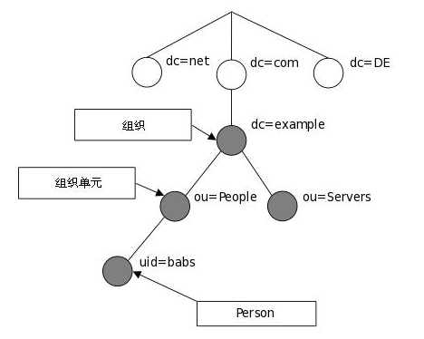
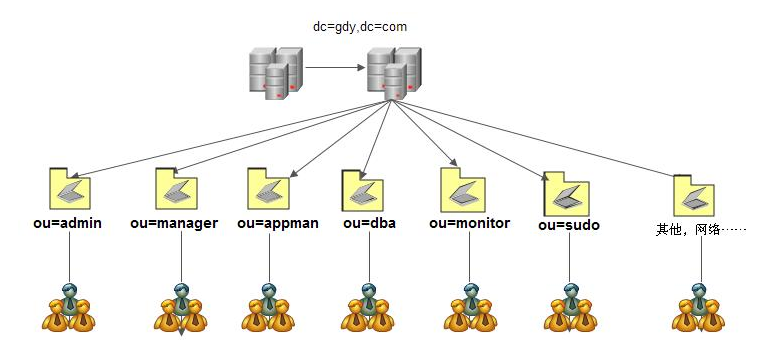
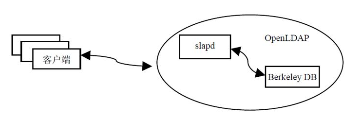

# OpenLDAP 学习文档

- [OpenLDAP 学习文档](#openldap-----)
  * [基础篇](#---)
    + [互联网命名组织架构](#---------)
    + [企业命名组织架构](#--------)
    + [openldap工作模型](#openldap----)

## 基础篇

OpenLDAP目前是一款开源账号集中管理软件, 且属于C/S架构。通过配置服务器和客户端, 实现账号的管理, 并通过与第三方应用相结合, 实现客户端所有账号均可通过服务端进行验证, 例如`Samba`、`Apache`、`Zabbix`、`FTP`、`Postfix`、`EMC存储`以及`系统登录验证并授权`。

### 互联网命名组织架构

LDAP的目录信息以树形结构进行存储: 

- 在树根一般定义国家（`c=CN`）或者域名（`dc=com`）

- 其次往往定义一个或多个组织（`organization`, `o`）或组织单元（`organization unit`, `ou`）

- 一个组织单元可以包含员工、设备信息（计算机/打印机等）相关信息。例如 `uid=babs,ou=People,dc=example,dc=com`

### 企业命名组织架构

### openldap工作模型

- 客户端向OpenLDAP服务器发起验证请求

- 服务器接收用户请求后, 并通过`slapd`进程向后端的数据库进行查询

- `slapd`将查询的结果返回给客户端即可。如果有缓存机制, 服务器端会先将查询的条目进行缓存, 然后再发给客户端

### schema

在OpenLDAP目录树中, `schema`用来指定一个条目所包含的**对象类**（`objectClass`）以及每一个对象类所包含的**属性值**（`attribute value`）。其属性又分为**必要属性**和**可选属性**两种, 一般必要属性是指添加条目时必须指定的属性, 可选属性是可以选择或不选择的。`schema`定义对象类, 对象类包含属性的定义, 对象类和属性组合成条目。

目录树中条目可理解为是一个具体的对象, 它们均是通过`schema`创建的, 并符合`schema`的标准规范, 如对你所添加的数据条目中所包含的对象类级属性进行检测, 检测通过完成添加, 否则打印错误信息。因此, `schema`是一个数据模型, 数据模型可以理解为关系数据库的存储引擎, 如`MyISAM`、`InnoDB`, 主要用来决定数据按照什么方式进行存储, 并定义存储在目录树不同条目中数据类型之间的关系。

`schema`是一个标准, 定义了**OpenLDAP目录树对象和属性存取方式**, 这也是OpenLDAP能够存储什么数据类型的取决因素。因此数据有什么属性等均根据`schema`来实现。OpenLDAP默认的`schema`文件一般存放在`/etc/openldap/schema/`目录下, 此目录下每个文件定义了不同的对象类和属性。如果想引用额外的`schema`, 只需要在配置文件中通过include包含所指定的`schema`即可。

> 注: 旧版本 `openldap` 使用`/etc/openldap/slapd.conf`配置schema (`man 5 slapd.conf`), 新版本中已经修改为`ldap-enabled`(`/etc/openldap/slapd.d`), **新版仍然兼容旧版本配置**

